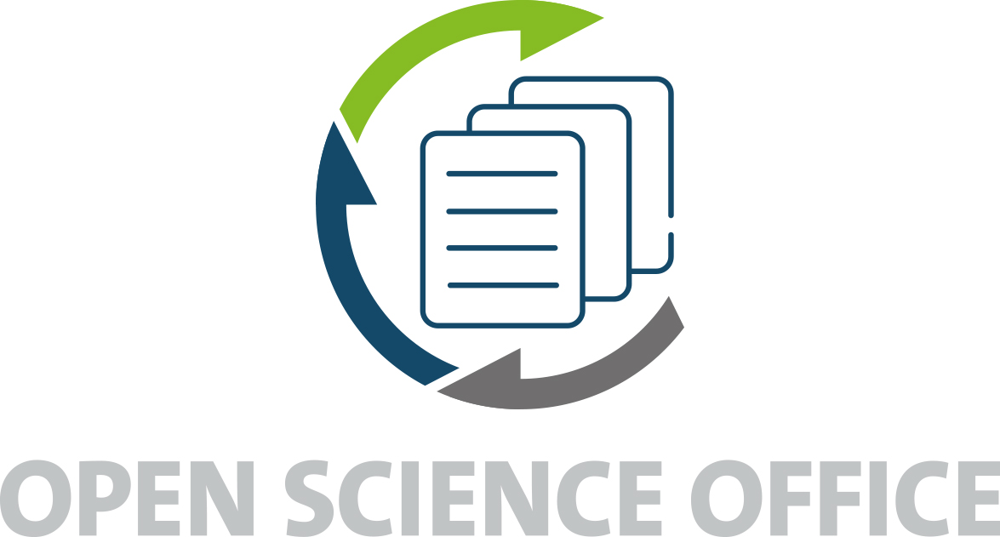

## "What's in this repository?"

This repository contains the skeleton for the CIMH neuroimaging workshop.

## Credits

This repository was created using the [G0RELLA template](https://github.com/G0RELLA/gorella_base) 

## "I have some questions..."

[Open an issue](https://github.com/JohannesWiesner/workshop_cimh/issues) on this repository and someone will try and get back to you as soon as possible!
